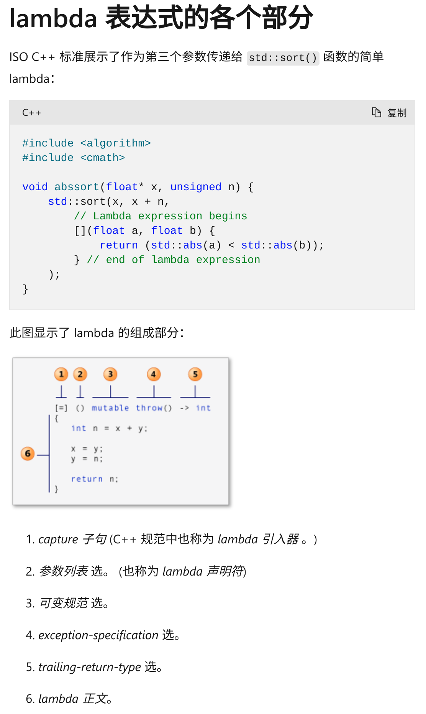

# A Simple Thread Pool Impletemeted in C++

 
 
在主线程（main）中，通过遍历各个线程，get一下其异步输出std::future，来保证线程被终止（实现同步，构造一个barrier相当于）。
```cpp
for (auto&& result : results) {
    leveldb::Status status = result.get();
}
```

